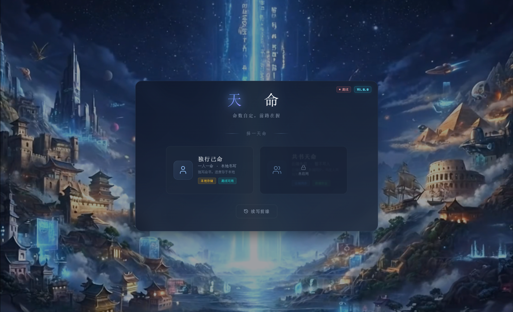

<p align="center">
  
</p>

<table align="center">
  <tr>
    <td></td>
    <td></td>
  </tr>
</table>

<h1 align="center">天命（MING）</h1>

<p align="center">
  <strong>AI 驱动的沉浸式文字冒险 · 通用版（不绑定修仙）</strong>
</p>

<p align="center">
  <a href="#功能概览">功能</a> •
  <a href="#技术栈">技术栈</a> •
  <a href="#快速开始">快速开始</a> •
  <a href="#更新日志">更新日志</a> •
  <a href="#许可证">许可证</a>
</p>

<p align="center">
  
  
  
  
  
</p>

<p align="center">
  
  
  
  
</p>

<p align="center">
  <!-- 将 your-username 替换为你的 GitHub 用户名 -->
  
  
  
</p>

---

## ✨ 功能概览

🤖 **AI 动态叙事** — 支持 Gemini / Claude / OpenAI / DeepSeek 等多种大模型，实时生成个性化剧情

📜 **通用叙事框架** — 不绑定修仙设定；特质、地位、六维属性、体力/精力/洞察力、金钱体系，可适配多种世界观

🎲 **智能判定系统** — 基于属性、装备、状态等多维度计算判定结果

💾 **多存档管理** — 多角色、多存档槽位，支持导入导出与云同步（可选后端）

🗺️ **探索地图** — 层级化世界地点结构，缩放/平移/双击钻取，色系区分与当前位置高亮，支持探索状态与教程说明

📱 **全平台与双主题** — 桌面端与移动端适配；亮色主题柔光、边框清晰、半透明透出封面视频，与暗色一致

🍺 **酒馆兼容** — 支持 SillyTavern 嵌入式环境与独立网页版

---

## 🛠️ 技术栈

|        前端        |        后端        |     AI     |
| :----------------: | :-----------------: | :---------: |
| Vue 3 + TypeScript |  Python + FastAPI  | Gemini API |
|   Pinia 状态管理   | SQLite / PostgreSQL | Claude API |
|     Vue Router     |      JWT 认证      | OpenAI API |
|      Webpack       |      WebSocket      | DeepSeek   |
| Cytoscape / IndexedDB |                    | SillyTavern |

---

## 🚀 快速开始

### Docker 部署（推荐）

```bash
docker run -d -p 8080:80 your-username/ming:latest
```

访问 http://localhost:8080 即可使用。（若使用自有镜像，请将 `your-username` 换为实际仓库名。）

### 本地开发

```bash
# 安装依赖
npm install

# 开发模式（默认端口 9091）
npm run serve

# 生产构建
npm run build
```

封面背景视频放在 **`public/ming_background.mp4`**，构建时会复制到 `dist/`，开发时由 devServer 提供。

### 自动构建/部署

推送 `v*` 格式的 tag 时自动触发：

- **Docker 镜像**：构建并推送到 Docker Hub
- **GitHub Release**：创建 Release 并上传构建产物

```bash
git tag v1.0.0
git push origin v1.0.0
```

其他工作流：

- CI：`.github/workflows/ci.yml`（push/PR 自动 type-check + build）
- Pages：`.github/workflows/pages.yml`（可按需部署到 GitHub Pages）

### 后端（可选）

后端用于提供账号/存档等 API，默认使用 SQLite，开箱即用。

```bash
pip install -r server/requirements.txt
uvicorn server.main:app --reload --port 12345
```

环境变量配置见 `server/.env.example`

---

## 📖 更新日志

查看完整更新历史：[CHANGELOG.md](./CHANGELOG.md)，详细条目见 [CHANGELOG_MING.md](./CHANGELOG_MING.md)。

近期要点：

- **天命意象**：封面与模式选择改为「天命」主标题与择一天命/独行己命/共书天命等表述；创角七步四字命名（万象择一、禀赋天成、因果前缘、性灵所钟、才情所钟、命格初成、一览终章）；天命点显示与消耗
- **通用命名**：特质（原灵根）、地位（原境界）、六维属性、体力/精力/洞察力、金钱四档；创角数据去修仙化
- **亮色主题**：柔光、边框可见、创角/模式选择主区半透明透出封面视频
- **探索地图**：层级结构、色系与当前位置高亮、教程弹窗、探索状态 tooltip
- **世界心跳**：可配置周期与历史条数，关系网络扩展
- **封面本地化**：`public/ming_background.mp4`，不再依赖第三方视频链接

---

## 🤝 贡献

欢迎提交 Issue 和 Pull Request！

详见 [CONTRIBUTING.md](./CONTRIBUTING.md)（含中文提交信息避免乱码说明）。

---

## 📄 许可证

本项目采用 Apache-2.0 许可证。个人学习、研究免费使用；商业用途请先联系作者。

详见 [LICENSE](./LICENSE)

---

<p align="center">
  <sub>如果觉得有帮助，请给个 ⭐ Star 支持一下！</sub>
</p>
